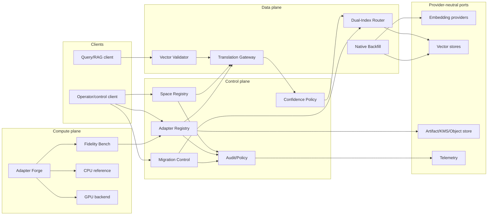
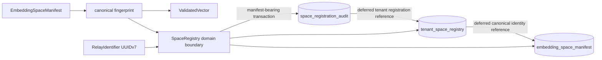

# EmbedRelay Architecture

**Status:** Accepted target architecture; current M1 active-PR scope is explicitly labelled.  
**Last reviewed:** 2026-09-02

## Architectural goal

EmbedRelay is embedding continuity infrastructure, not an embedding provider and not a vector database. It sits between encoders, vector stores, migration operators, and retrieval clients to prevent incompatible-space comparison and to manage measurable, reversible migration toward a target-native state.

## Product planes



## Current M1 active-PR boundary

PR #1 now contains two coupled implementation layers:

1. a Rust domain-contract crate implementing canonical embedding-space identity, fail-closed vector validation, RFC 9562 UUIDv7 identifier semantics, tenant-isolated reference registration, and audit-before-mutation intent behavior; and
2. a PostgreSQL 18.x persistence slice implementing immutable canonical-manifest storage, tenant/fingerprint registration, durable `space_registration_intent` audit, forced RLS, append-only durability, deterministic duplicate/concurrent registration behavior, manifest/fingerprint recomputation, logical backup/restore acceptance, and guarded rollback.

The PostgreSQL slice is active-PR source only, not protected-main or release evidence. Deployable service/API, adapter fitting/evaluation, artifact loading, confidence policy, translation gateway, dual-index routing, native backfill, provider/vector-store ports, broader service/admin roles, production recovery architecture, and GPU compute remain incomplete or planned.



The persistence transaction boundary is one manifest-bearing tenant/fingerprint registration attempt. Audit intent is inserted first; tenant registration and canonical manifest insert-or-match follow in the same transaction. Duplicate same-tenant registration is deliberately rejected by the unique `(tenant_id, space_fingerprint)` key and rolls the attempted audit insert back. An identical canonical manifest may be reused across tenants because the immutable compatibility fact is stored once globally by exact fingerprint; conflicting material for the same fingerprint fails closed. This is distinct from a replay-idempotency API.

## Domain boundaries

### Core subdomain — Embedding Continuity

Owns canonical space identity, compatibility, directional adapter fidelity, abstention, migration correctness, and target-native convergence.

### Supporting subdomain — Registry Governance

Owns immutable canonical manifests, tenant-scoped registration, durable audit, drift quarantine, and release evidence. The active M1 PostgreSQL slice belongs here.

### Supporting subdomain — Migration Operations

Owns dual-index state, rollback windows, migration stages, and native-backfill progress. It remains planned.

### Generic integration subdomain

Provider, vector-store, object-store/KMS, telemetry, and identity integrations remain versioned ports behind anti-corruption layers. Vendor SDK types and another ContextualWisdomLab repository's private database model are not shared-kernel contracts.

## Trust boundaries

1. **Vector input boundary:** vectors and manifests are untrusted until space and numeric validation passes.
2. **Tenant authority boundary:** tenant authorization is explicit; UUID/fingerprint/vector content never proves tenancy. Current M1 PostgreSQL tenant registry/audit tables force RLS against explicit `embedrelay.tenant_id`; canonical manifest visibility is derived through an authorized tenant registration.
3. **Persistence mutation boundary:** registry/manifest/audit rows are append-only; destructive rollback is a separately gated operator migration action.
4. **Adapter artifact boundary:** weights/manifests are immutable, digest-bound, signed/reviewed artifacts before production use.
5. **Provider boundary:** provider responses are revalidated for dimension/space contract; model names are not trusted identities.
6. **Vector-store boundary:** score semantics are space/index-specific; the router combines ranks/results, not raw incompatible scores by default.
7. **Automation/release boundary:** model development/review credentials remain separate from protected merge/release authority.

## Space registry

The Rust reference registry proves `(tenant_id, canonical_fingerprint)` registration and audit-before-visibility semantics. The PostgreSQL implementation persists the canonical v1 manifest once in `embedding_space_manifest`, separately records tenant ownership in `tenant_space_registry`, and records append-only registration intent in `space_registration_audit`.

`register_tenant_space_manifest(uuid, text, jsonb)` accepts exactly the v1 material keys, validates their primitive/value contracts, recomputes the Rust-compatible `sha256:<64 lowercase hex>` identity using the same domain separator and UTF-8 byte-length framing, then atomically materializes audit, tenant registration, and canonical manifest state. Provider/model output drift therefore creates a new identity rather than mutating an existing manifest.

## Persistence architecture

Current active-PR physical objects:

- `embedding_space_manifest` — immutable normalized compatibility material, one row per exact canonical fingerprint;
- `tenant_space_registry` — immutable per-tenant fingerprint registration, PostgreSQL UUIDv7 record ID, unique tenant/fingerprint key, deferred reference to canonical manifest;
- `space_registration_audit` — append-only audit intent, PostgreSQL UUIDv7 event ID, actor/action evidence, deferred reference to tenant registration;
- `register_tenant_space(uuid, text)` — lower-level fingerprint registration primitive retained for the first migration boundary;
- `register_tenant_space_manifest(uuid, text, jsonb)` — manifest-bearing M1 command that makes the complete relational invariant satisfiable after migration 0002;
- forced RLS on all three tables; manifest visibility depends on a matching tenant registration;
- update/delete/truncate rejection triggers;
- guarded destructive down migrations;
- PostgreSQL 18.6 contract and logical backup/restore tests.

The slice is in 3NF: immutable manifest facts are keyed by fingerprint once, tenant registration facts are independent associations, and audit-event facts remain separate. There is no global application lock. Contention is localized to canonical fingerprint insertion and tenant/fingerprint uniqueness. No partitioning, read/write split, replica topology, or CQRS is claimed without measured pressure. The database is an internal persistence boundary and is not a public integration surface for downstream repositories.

Broader target persistence still includes adapter/evaluation artifacts, vector references, migration plans/stages, index bindings, backfill tasks, drift events, policy decisions, and broader audit/provenance records.

## Adapter lifecycle

```text
candidate
→ training
→ evaluated
→ calibrated
→ approved
→ active
→ deprecated
→ retired
```

Rejection or abstention is a normal state. A production adapter references immutable source/target spaces, role, algorithm/version, training/evaluation provenance, artifact digest, confidence policy, and release evidence.

## Migration lifecycle

```text
planned
→ shadow / evaluation
→ dual-index
→ bounded canary
→ progressive cutover
→ target-primary
→ native-backfill-complete
→ source-retained-for-rollback-window
→ completed
```

Rollback remains available until explicit acceptance criteria and retention policy retire the source path.

## Compute architecture

Production arithmetic is Rust-first. CPU is the numerical correctness reference. GPU is introduced only for computationally material workloads after profiling; all GPU outputs require parity/recovery evidence. Transfer overhead, peak VRAM, batch adaptation, precision mode, kernel/runtime version, and fallback cause are observable.

## Provider/vector-store neutrality

Ports expose versioned capabilities such as encode query/document, batch encode, create/read/write index vector, query index, and retrieve source content for native backfill. Core domain code may not import vendor SDK types.

## ContextualWisdomLab ecosystem boundary

- contextual-orchestrator may route model/provider calls but is optional and separately deployable;
- pg-llm-batch may provide batch orchestration through a typed adapter;
- EgressWeave may enforce approved outbound-provider policy;
- Keyverse may provide identity/federation at a service wrapper;
- naruon may consume migration/retrieval capabilities through a public API/SDK;
- no integration requires direct access to another service's private database.

## Release architecture

A released version requires immutable source, exact CI/security/review evidence, locked/reproducible dependencies, exact coverage/docstrings, PostgreSQL migration/RLS/concurrency/manifest/rollback verification for the persisted M1 surface, measured recovery evidence appropriate to production persistence, SBOM/provenance, signed adapter/release artifacts where applicable, retrieval-level fidelity gates for adapter/migration capabilities, and post-publication smoke evidence. A model or autonomous agent cannot independently approve its own numerical cutover or release.
