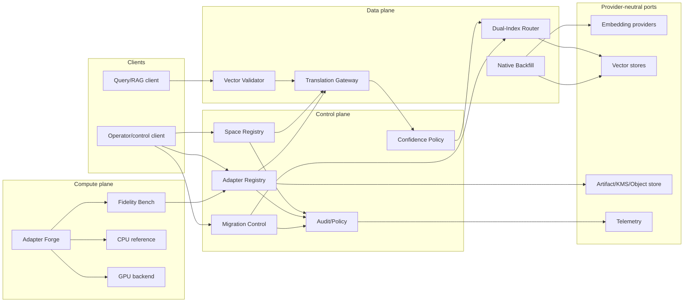
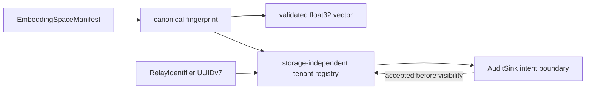

# EmbedRelay Architecture

**Status:** Accepted target architecture; current M1 as-built scope is explicitly labelled.  
**Last reviewed:** 2026-08-15

## Architectural goal

EmbedRelay is embedding continuity infrastructure, not an embedding provider and not a vector database. It sits between encoders, vector stores, migration operators, and retrieval clients to prevent incompatible-space comparison and to manage measurable, reversible migration toward a target-native state.

## Product planes



## Current M1 as-built boundary

PR #1 currently contains a storage-independent Rust contract crate. It implements canonical embedding-space identity, vector validation, RFC 9562 UUIDv7 durable identifier semantics, tenant-isolated in-memory registration, and audit-before-mutation intent behavior. The following are **not** as-built yet: PostgreSQL/RLS persistence, durable audit/outbox, adapter fitting, artifact loading, translation gateway, routing, backfill, provider/vector-store ports, or GPU compute.



## Trust boundaries

1. **Vector input boundary:** vectors and manifests are untrusted until space and numeric validation passes.
2. **Tenant authority boundary:** tenant authorization is explicit; UUID/fingerprint/vector content never proves tenancy.
3. **Adapter artifact boundary:** weights/manifests are immutable, digest-bound, signed/reviewed artifacts before production use.
4. **Provider boundary:** provider responses are revalidated for dimension/space contract; model names are not trusted identities.
5. **Vector-store boundary:** score semantics are space/index-specific; the router combines ranks/results, not raw incompatible scores by default.
6. **Automation/release boundary:** model development/review credentials remain separate from protected merge/release authority.

## Space registry

The current M1 registry is a storage-independent in-memory reference that holds only `(tenant_id, canonical_fingerprint)` registration keys after the audit-intent boundary accepts them. The target durable registry is the root compatibility authority and will store immutable canonical manifests/fingerprints plus lifecycle state. If output drift is detected under the same provider/model label, the existing space is not mutated; a new or quarantined space identity is required.

## Adapter lifecycle

```text
candidate
→ training
→ evaluated
→ calibrated
→ approved
→ active
→ deprecated
→ retired
```

Rejection or abstention is a normal state. A production adapter references immutable source/target spaces, role, algorithm/version, training/evaluation provenance, artifact digest, confidence policy, and release evidence.

## Migration lifecycle

```text
planned
→ shadow / evaluation
→ dual-index
→ bounded canary
→ progressive cutover
→ target-primary
→ native-backfill-complete
→ source-retained-for-rollback-window
→ completed
```

Rollback remains available until explicit acceptance criteria and retention policy retire the source path.

## Compute architecture

Production arithmetic is Rust-first. CPU is the numerical correctness reference. GPU is introduced only for computationally material workloads after profiling; all GPU outputs require parity/recovery evidence. Transfer overhead, peak VRAM, batch adaptation, precision mode, kernel/runtime version, and fallback cause are observable.

## Persistence target

PostgreSQL 18.x is the planned durable control-plane store with tenant-aware RLS and explicit append-only audit semantics. Object storage/KMS holds signed adapter/evaluation artifacts. Vector values themselves may remain in external vector stores, referenced by opaque records and provenance rather than duplicated unnecessarily.

## Provider/vector-store neutrality

Ports expose versioned capabilities such as encode query/document, batch encode, create/read/write index vector, query index, and retrieve source content for native backfill. Core domain code may not import vendor SDK types.

## CWL ecosystem boundary

- contextual-orchestrator may route model/provider calls but is optional and separately deployable;
- pg-llm-batch may provide batch orchestration through a typed adapter;
- EgressWeave may enforce approved outbound-provider policy;
- Keyverse may provide identity/federation at a service wrapper;
- naruon may consume migration/retrieval capabilities through a public API/SDK;
- no integration requires direct access to another service's private database.

## Release architecture

A released version requires immutable source, exact CI/security/review evidence, exact coverage/docstrings, migration/rollback verification, SBOM/provenance, signed adapter/release artifacts where applicable, retrieval-level fidelity gates, and post-publication smoke evidence. A model or autonomous agent cannot independently approve its own numerical cutover or release.
