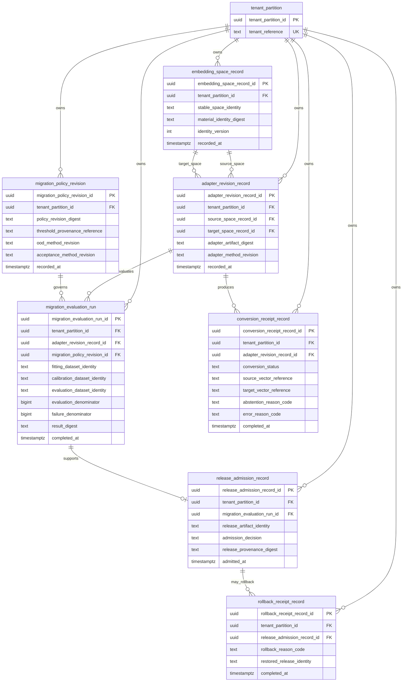

# EmbedRelay conceptual ERD

Status: future relational persistence target; **no current database is claimed**
Last reconciled: 2026-09-02

This model exists to constrain naming, tenant isolation, normalization and evidence ownership before persistence implementation. Every object name contains at least two semantic words and uses `snake_case`. The target remains third normal form; vector-store payload/index persistence stays outside this relational authority.

## Normalization and authority

- `embedding_space_record` stores identity/evidence metadata, not vector bodies.
- `adapter_revision_record` references source/target spaces instead of duplicating their material fields.
- `migration_evaluation_run` references one adapter and one policy revision; dataset identities are immutable external evidence references, not copied datasets.
- `conversion_receipt_record` stores bounded evidence/reference metadata; vector bytes remain with the owning runtime/vector store unless a future approved requirement establishes a separate encrypted evidence store.
- release and rollback records are completed facts and therefore append-only after acceptance.

## Tenant isolation

Every tenant-owned relation includes `tenant_partition_id`. Foreign keys between tenant-owned objects must be composite tenant-safe references or equivalent constraints so a valid object identifier from another tenant cannot satisfy a reference. A shared PostgreSQL deployment uses forced RLS or an equivalent fail-closed policy under a `NOSUPERUSER NOBYPASSRLS` application role.

## Identity and idempotency

Stable business/evidence identities require explicit unique constraints separate from surrogate row identifiers. Item-level UPSERT semantics must define exact retry versus conflicting reuse before implementation. Concurrent insert tests must prove that duplicate races cannot create two accepted authorities.

## Partitioning and lock policy

No partitioning or read/write split is prescribed today. Measure row/index contention, hot tenant/space/adapter keys, queue depth and transaction latency first. If partitioning is justified, tenant plus high-cardinality domain identity should be evaluated from measured distribution rather than a rule of thumb.

This ERD is a target fitness constraint. Migrations and actual tables are absent until a persistence slice implements and tests them.
