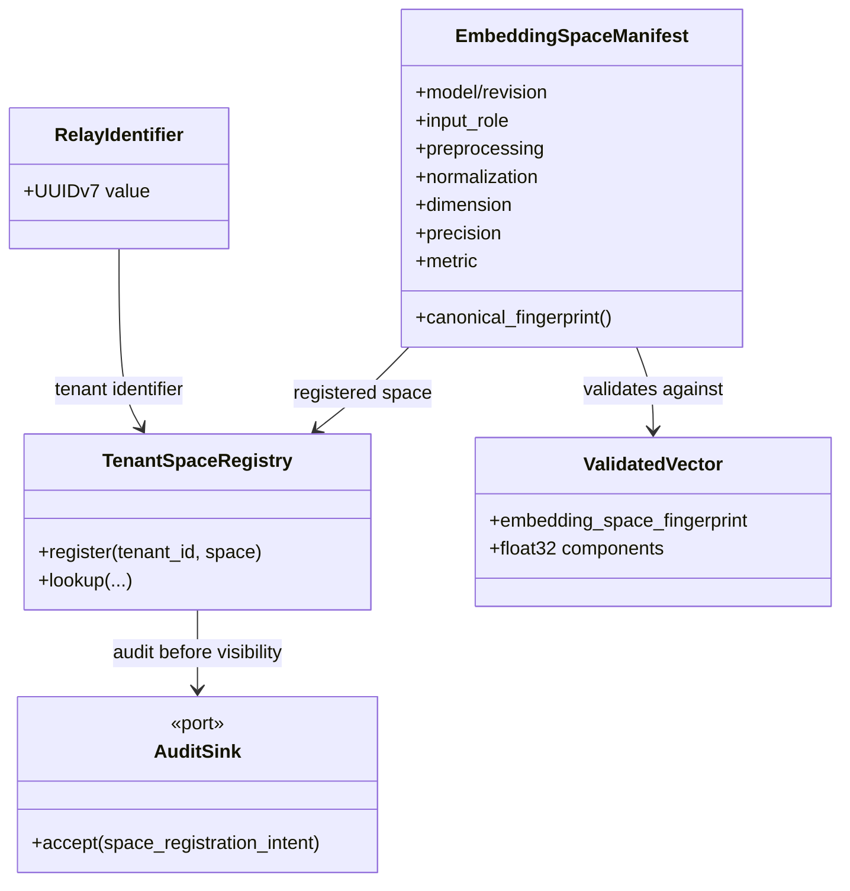
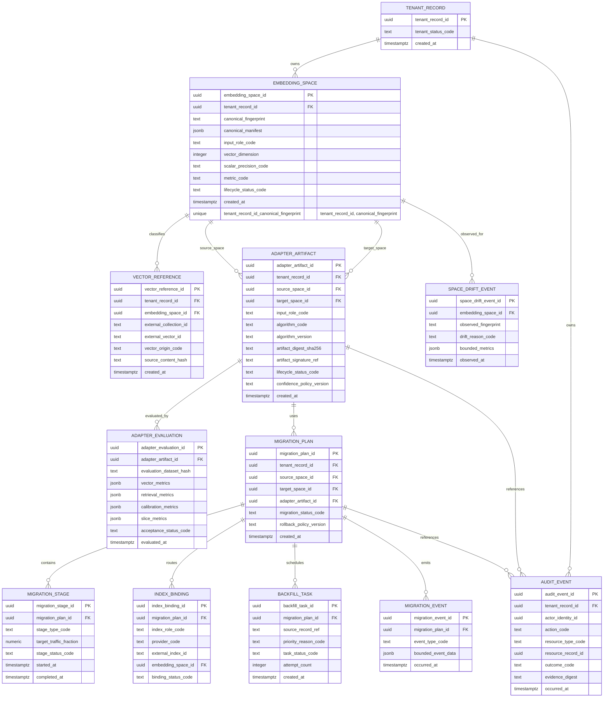
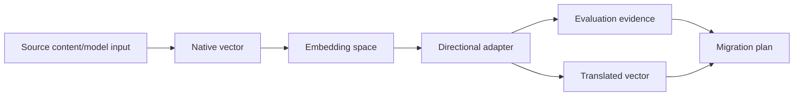

# EmbedRelay Data Model and ERD

**Status:** Accepted conceptual target model. Current PR #1 persists none of these tables yet.  
**Last reviewed:** 2026-08-15

The model distinguishes **as-built Rust domain objects** from **planned PostgreSQL persistence**. All persistent object names use descriptive two-or-more-word `snake_case` names.

## Current in-memory domain model

## Planned PostgreSQL control-plane ERD

## Persistence invariants

- Every operational record is tenant-bound either directly or through a transactionally constrained parent.
- UUIDv7 is an opaque identifier shape, not authorization or business chronology.
- `(tenant_record_id, canonical_fingerprint)` is unique; the same canonical fingerprint may exist independently for different tenants.
- `canonical_fingerprint` cannot be mutated after dependent vectors/adapters/migrations exist; drift creates a new/quarantined space.
- A production adapter is immutable after approval; a changed artifact creates a new `adapter_artifact_id`.
- Audit events are append-only under the durable design.
- Adapter direction is explicit through separate `source_space_id` and `target_space_id`; reverse direction is another artifact.
- `vector_origin_code` distinguishes native/translated/reconstructed/composed states.
- Cross-space raw metric computation is forbidden by application/domain constraints even if dimensions match.

## RLS and authorization target

PostgreSQL RLS is planned for tenant-scoped control-plane tables, but it is **not implemented** in the current PR. The durable migration PR must prove forced RLS, service-role policy, cross-tenant negative tests, transaction isolation, and admin/audit access boundaries before this document labels RLS as as-built.

## Lineage view

Every translated result must be traceable to source space, target space, adapter artifact, evaluation/confidence policy, and source vector/content identity where policy allows.

## Migration acceptance

Before these conceptual entities become persisted tables, the implementing PR must include migrations/rollback, RLS/tenant tests, unique/foreign/check constraints, indexes/capacity rationale, audit immutability, transaction/idempotency/concurrency tests, backup/recovery impact, and synchronized API/security/operability/ADR documentation.
