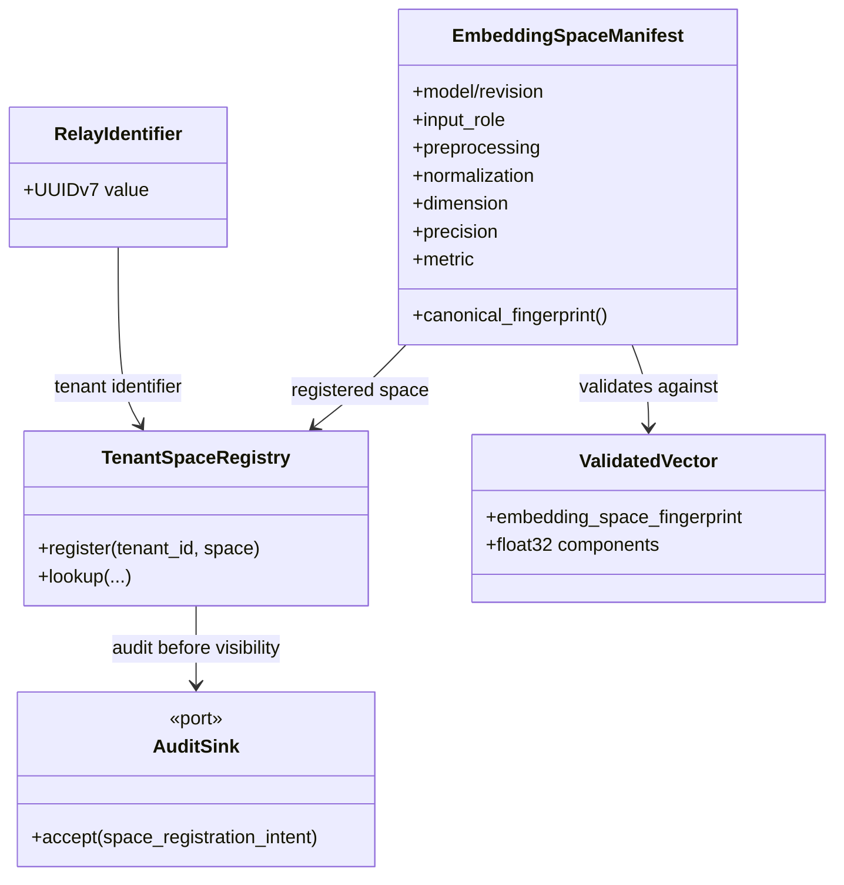
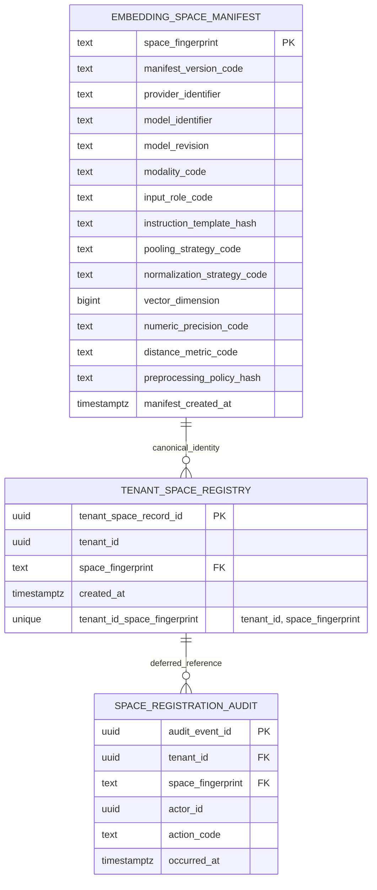
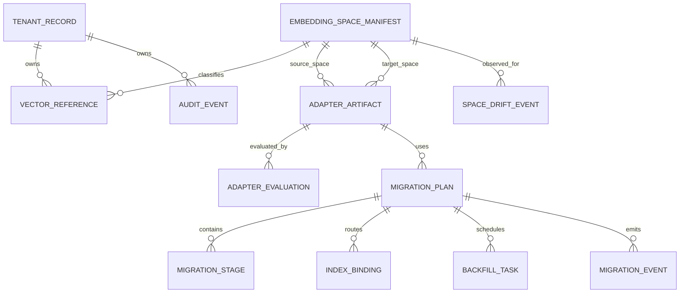

# EmbedRelay Data Model and ERD

**Status:** Accepted target model with an executable M1 physical persistence slice on active PR #1.  
**Last reviewed:** 2026-09-02

EmbedRelay separates the current Rust domain contract, the current PostgreSQL M1 registry/manifest/audit slice, and the broader planned control-plane model. Persistent object names use descriptive two-or-more-word `snake_case` names.

## Current Rust domain model

## As-built PostgreSQL M1 slice

<!-- status:present-current -->

The active PR carries physical migrations for the tenant registry, immutable canonical manifest, and audit boundary. This is active-PR implementation, not protected-main or release evidence.

Physical source of truth:

- schema: `embedrelay_registry`;
- canonical manifest table: `embedding_space_manifest`;
- registry table: `tenant_space_registry`;
- audit table: `space_registration_audit`;
- low-level registration function: `register_tenant_space(uuid, text)`;
- manifest-bearing registration function: `register_tenant_space_manifest(uuid, text, jsonb)`;
- rollback gate: `embedrelay.allow_destructive_rollback=on`;
- migrations: `migrations/0001_tenant_space_registry.*.sql` and `migrations/0002_embedding_space_manifest.*.sql`.

`tenant_space_registry` and `space_registration_audit` use PostgreSQL 18 `uuidv7()` identifiers. `(tenant_id, space_fingerprint)` is unique. `space_registration_audit` has a deferred foreign key to that natural registration key so audit intent can be inserted before registry visibility within one transaction. `tenant_space_registry.space_fingerprint` has a deferred foreign key to the global canonical manifest table so the manifest can be materialized later in the same manifest-bearing transaction while every committed registration still resolves to complete immutable identity material.

The canonical manifest table stores one v1 material row per exact fingerprint rather than duplicating provider/model/role/hash/dimension/metric fields per tenant. `register_tenant_space_manifest` validates the exact v1 JSON key set, value shape, Rust u32 dimension range, canonical material hashes, and then recomputes the Rust-compatible domain-separated SHA-256 fingerprint before persistence. A mismatch fails closed. Identical cross-tenant manifests therefore deduplicate by immutable fingerprint; tenant ownership remains independent in `tenant_space_registry`.

The migration enables and **forces RLS** on all three relations. Registry/audit policies compare each row's `tenant_id` with explicit `embedrelay.tenant_id`. Canonical manifest visibility is derived with an `EXISTS` check against the current tenant's authorized registry row, so an unregistered tenant cannot enumerate shared compatibility material.

All three physical relations are append-only. Row update/delete and table truncate operations raise SQLSTATE `55000`. Destructive rollback is a separately gated migration operation, not ordinary product mutation.

Tenant registration remains intentionally not an UPSERT. Duplicate `(tenant_id, space_fingerprint)` registration raises the unique-key outcome; because audit insertion, registration, and manifest insert-or-match share one transaction, the losing duplicate/concurrent attempt does not leave a second audit event. Canonical manifest persistence has explicit item-level insert-or-match semantics because the same immutable compatibility fact is intentionally reusable across tenants; after conflict every material field is rechecked. A future request-replay contract still requires an explicit idempotency key.

### 3NF and contention boundary

The M1 slice is in 3NF: immutable embedding-space compatibility facts live once in `embedding_space_manifest`; tenant-to-space association facts live in `tenant_space_registry`; audit-event facts live in `space_registration_audit`. Neither tenant registration nor audit duplicates mutable manifest material.

Concurrency is localized to the global fingerprint primary key and tenant/fingerprint unique key. Two identical same-tenant registrations intentionally contend and produce one winner; two tenants registering the identical manifest may share the canonical row while retaining independent tenant registrations. No global application lock, read/write split, or partitioning is introduced without measured need; hot-partition mitigation must preserve tenant RLS and registration invariants when evidence justifies it.

## Broader PostgreSQL control-plane target

<!-- status:planned -->

The physical M1 slice does not make the full target model as-built. Later milestones still own the following planned relations and their exact names/contracts:

Planned target objects still include `tenant_record`, `vector_reference`, `adapter_artifact`, `adapter_evaluation`, `migration_plan`, `migration_stage`, `index_binding`, `backfill_task`, `migration_event`, broader `audit_event`, and `space_drift_event`. The active `embedding_space_manifest` is the M1 canonical identity table; later migrations may extend lifecycle relationships without mutating its identity material.

## Persistence invariants

- Every operational tenant-owned record is tenant-bound directly or through a transactionally constrained parent.
- UUIDv7 is an opaque identifier shape, not authorization or business chronology.
- Equal vector dimensions never establish space compatibility.
- A canonical space fingerprint and its material are immutable once registered; changed geometry becomes a new/quarantined space identity.
- Current M1 durable registry, manifest, and audit records are append-only.
- Adapter direction will remain explicit through separate source/target space identities.
- Vector origin will distinguish native/translated/reconstructed/composed states when vector-reference persistence becomes executable.
- Cross-space raw metric computation is forbidden by the Rust domain contract regardless of relational shape.

## RLS and authorization boundary

RLS is as-built for `tenant_space_registry`, `space_registration_audit`, and `embedding_space_manifest` on active PR #1. The PostgreSQL contracts use a non-superuser, non-`BYPASSRLS` role to prove same-tenant access, cross-tenant denial, and inability of an unregistered tenant to enumerate canonical manifest material. Broader service/admin/audit roles, KMS integration, retention/export governance, and future control-plane tables remain unimplemented and must not be inferred from this slice.

## Evidence promotion rule

This ERD describes active-PR source. It becomes protected-main truth only after the exact implementing head passes PostgreSQL 18.6 migration/RLS/concurrency/manifest/rollback/restore tests, Rust CI/security gates, and qualifying independent review, then merges without governance bypass. The logical restore fixture is acceptance evidence for this disposable M1 state only and does not establish production RTO/RPO/PITR/HA.
