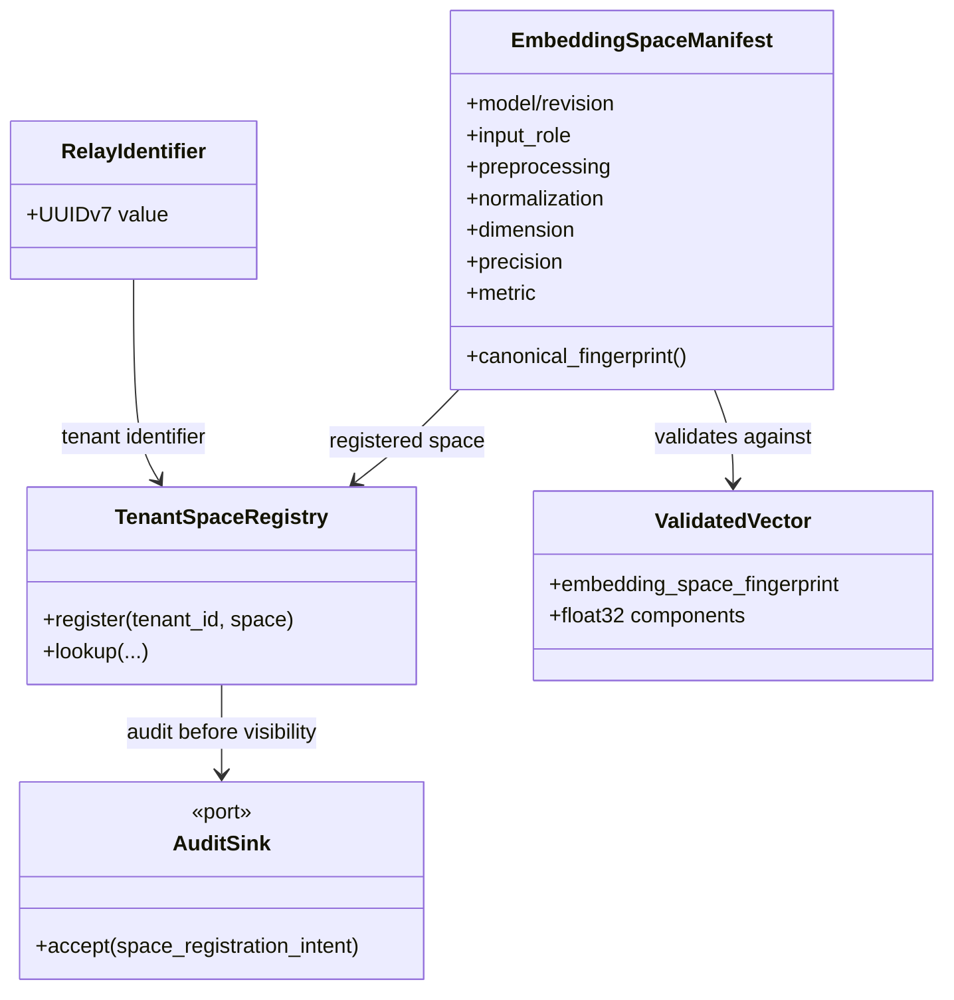
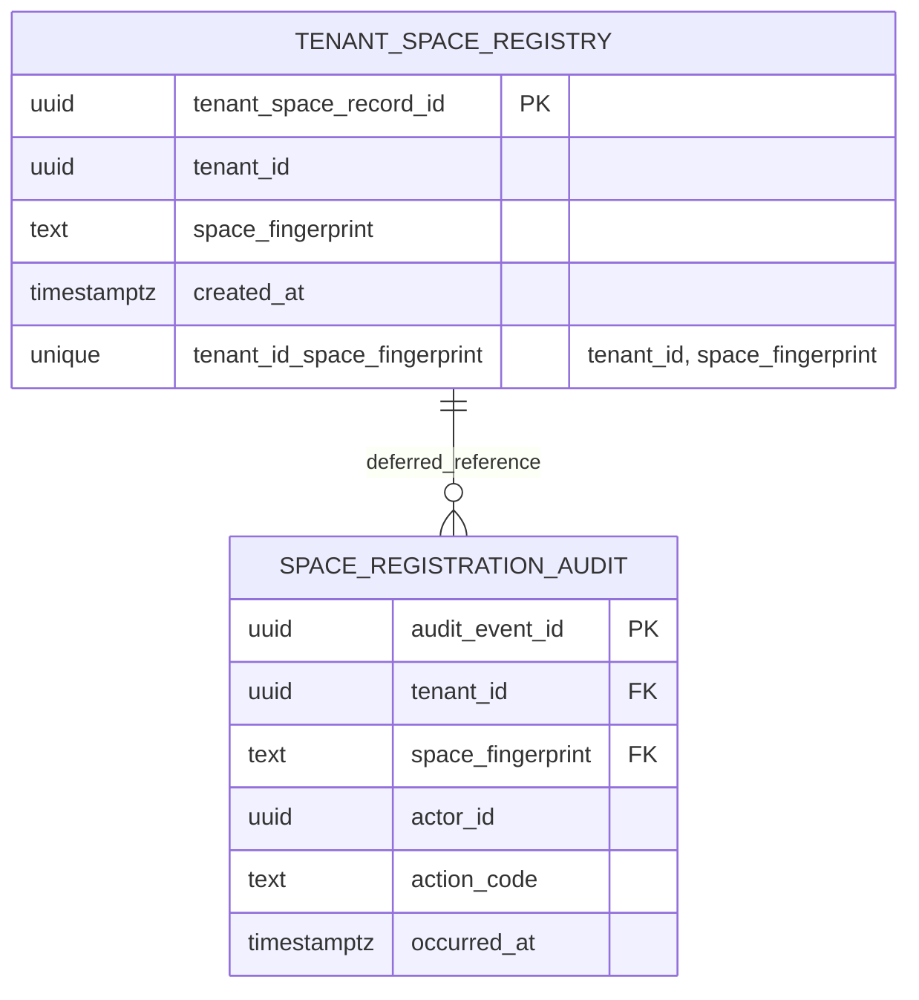
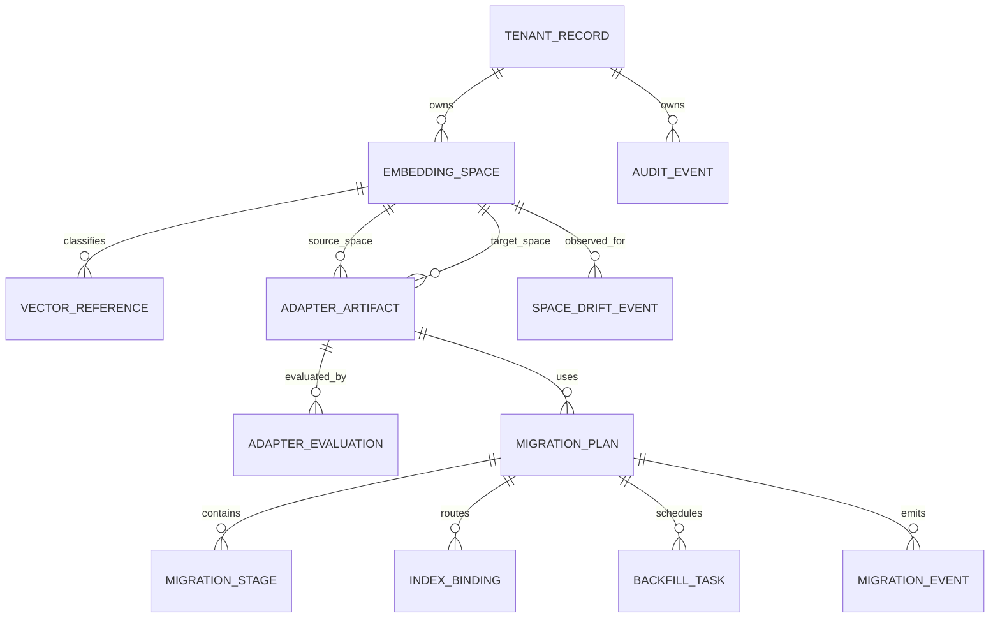

# EmbedRelay Data Model and ERD

**Status:** Accepted target model with an executable M1 physical persistence slice on active PR #1.  
**Last reviewed:** 2026-09-02

EmbedRelay separates the current Rust domain contract, the current PostgreSQL M1 registry/audit slice, and the broader planned control-plane model. Persistent object names use descriptive two-or-more-word `snake_case` names.

## Current Rust domain model

## As-built PostgreSQL M1 slice

The active PR now carries physical migrations for the narrow tenant registry boundary. This is active-PR implementation, not protected-main or release evidence.

Physical source of truth:

- schema: `embedrelay_registry`;
- registry table: `tenant_space_registry`;
- audit table: `space_registration_audit`;
- registration function: `register_tenant_space(uuid, text)`;
- rollback gate: `embedrelay.allow_destructive_rollback=on`;
- migrations: `migrations/0001_tenant_space_registry.up.sql` and `.down.sql`.

Both tables use PostgreSQL 18 `uuidv7()` identifiers. `(tenant_id, space_fingerprint)` is unique. `space_registration_audit` has a deferred foreign key to that natural registration key so the audit intent can be inserted before the registry row within one transaction while still requiring a valid registry row at commit.

The migration enables and **forces forced RLS** on both tenant-scoped tables. Policies compare each row's `tenant_id` with the explicit `embedrelay.tenant_id` session context; missing context yields no authorized row and the registration function fails closed. Public/default privileges are revoked and service privileges must be granted deliberately.

Both physical relations are append-only. Row update/delete and table truncate operations raise SQLSTATE `55000`. Destructive rollback is a separately gated migration operation, not ordinary product mutation.

Registration is intentionally not an UPSERT. Duplicate `(tenant_id, space_fingerprint)` registration raises the unique-key outcome; because the audit insert and registry insert share one transaction, the losing duplicate/concurrent attempt does not leave a second audit event. A future idempotent replay contract would require an explicit request/idempotency key and separate tests.

### 3NF and contention boundary

The M1 slice is in 3NF: registry facts and audit-event facts are separate relations, with the audit relation depending on the registration key and its own audit-event key. No mutable manifest or adapter facts are duplicated into the audit record.

Concurrency is localized to the tenant/fingerprint unique key. Two identical concurrent registrations intentionally contend there and produce one winner. No global application lock, read/write split, or partitioning is introduced without measured need; hot-partition mitigation must preserve tenant RLS and registration invariants when evidence justifies it.

## Broader PostgreSQL control-plane target

The physical M1 slice does not make the full target model as-built. Later milestones still own the following planned relations and their exact names/contracts:

Planned target objects include `tenant_record`, `embedding_space`, `vector_reference`, `adapter_artifact`, `adapter_evaluation`, `migration_plan`, `migration_stage`, `index_binding`, `backfill_task`, `migration_event`, `audit_event`, and `space_drift_event`. They remain design targets until executable migrations/tests for their owning milestone exist.

## Persistence invariants

- Every operational record is tenant-bound directly or through a transactionally constrained parent.
- UUIDv7 is an opaque identifier shape, not authorization or business chronology.
- Equal vector dimensions never establish space compatibility.
- A canonical space fingerprint is immutable once registered; changed geometry becomes a new/quarantined space identity.
- Current M1 durable registry and audit records are append-only.
- Adapter direction will remain explicit through separate source/target space identities.
- Vector origin will distinguish native/translated/reconstructed/composed states when vector-reference persistence becomes executable.
- Cross-space raw metric computation is forbidden by the Rust domain contract regardless of relational shape.

## RLS and authorization boundary

RLS is as-built only for `tenant_space_registry` and `space_registration_audit` on active PR #1. The PostgreSQL contract uses a non-superuser, non-`BYPASSRLS` role to prove same-tenant access and cross-tenant denial. Broader service/admin/audit roles, KMS integration, retention/export governance, and future control-plane tables remain unimplemented and must not be inferred from this narrow slice.

## Evidence promotion rule

This ERD describes active-PR source. It becomes protected-main truth only after the exact implementing head passes PostgreSQL 18.6 migration/RLS/concurrency/rollback tests, Rust CI/security gates, and qualifying independent review, then merges without governance bypass. Backup/restore acceptance is still a separate commercialization gap.
