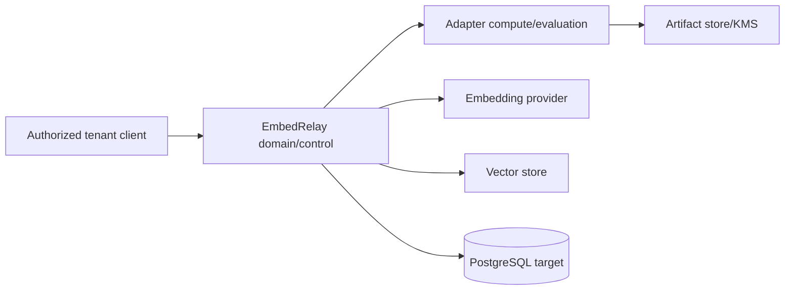

# EmbedRelay Threat Model

**Status:** Accepted baseline  
**Last reviewed:** 2026-08-09

## Scope and boundaries

Every external vector, manifest, provider response, anchor set, adapter artifact, index binding, and migration command is untrusted until its relevant validation/authorization boundary succeeds.

## Threat inventory

| Threat | Impact | Controls |
|---|---|---|
| equal-dimension incompatible vectors | silent retrieval corruption | canonical immutable space fingerprint; cross-space fail-closed metric guard |
| provider output drift under stable model label | corrupted mixed index | fingerprint/drift checks; quarantine/new space identity |
| poisoned anchors | malicious/biased adapter | provenance, split/slice evaluation, poisoning diagnostics, approval gate |
| substituted adapter artifact | arbitrary retrieval shift | immutable digest/signature, registry binding, artifact verification |
| low-confidence/OOD translation | degraded retrieval | calibrated confidence gate, explicit abstention/fallback |
| multi-hop error accumulation | opaque fidelity loss | one-hop production default |
| cross-tenant registry/vector access | data exposure/corruption | explicit tenant authority, planned forced RLS, negative tests |
| embedding inversion/linkage | source data disclosure | sensitive classification, access/retention/export controls |
| replay/idempotency abuse | duplicate migrations/backfill | tenant-scoped idempotency and transactional state transitions |
| rollback tampering | unavailable recovery path | immutable migration/audit evidence, retained source path during rollback window |
| raw-score fusion across spaces | ranking corruption | rank-level fusion/default reranker contract |
| malicious provider/vector-store response | crash/misclassification | bounded parsing, dimension/space/score semantic validation |
| model/agent self-approval | governance bypass | separate independent review/merge/release authority |

## STRIDE mapping

- **Spoofing:** tenant/actor/provider identities are explicit authenticated policy inputs; UUID or model label is never identity proof.
- **Tampering:** space manifests and released adapter artifacts are immutable/digest-bound; migrations/audit are append-only target contracts.
- **Repudiation:** state-changing registration/adapter/migration/backfill actions require audit evidence and correlation IDs.
- **Information disclosure:** embeddings, anchors, source refs, logs, and artifacts use least privilege, encryption, bounded retention, and controlled export.
- **Denial of service:** vector/batch/artifact sizes, compute jobs, provider retries, backfill concurrency, and migration traffic fractions are bounded.
- **Elevation of privilege:** domain data never changes authorization; automation/model processes do not receive merge/release authority.

## Current M1 security evidence

PR #1 currently proves fail-closed vector/space identity, RFC 9562 UUIDv7 parsing, tenant-isolated in-memory registration, and audit-before-mutation intent behavior. PostgreSQL RLS, artifact signing, provider/vector-store connectors, adapter training, migration routing, and backfill are future boundaries and require their own tests before being called implemented.

## Required future adversarial tests

- poisoned anchor concentration and label/content leakage;
- cross-tenant same-fingerprint access;
- forged/changed adapter manifest or digest;
- provider same-name geometry drift;
- malformed/high-magnitude/non-finite vector batches;
- OOD low-confidence abstention;
- migration stage replay/race/rollback;
- vector-store score-semantic mismatch;
- artifact rollback/substitution;
- inversion/linkage risk evaluation for supported data classes;
- GPU numerical divergence/fallback if accelerator paths are added.

## Review triggers

Re-evaluate when adding persistence/RLS, adapter artifact loading, a new fitting family, GPU execution, a provider/vector-store connector, multi-hop composition, new vector origin type, or a new migration/cutover authority.