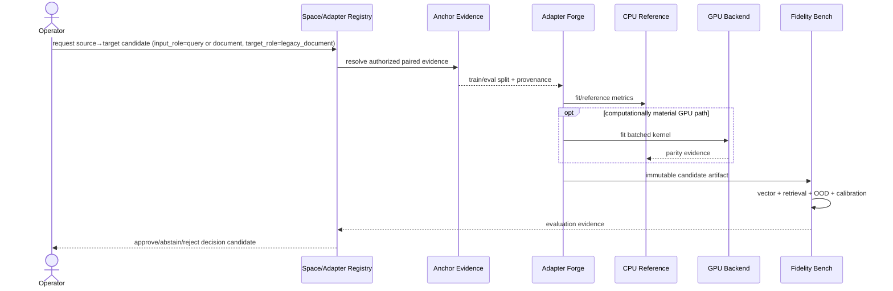
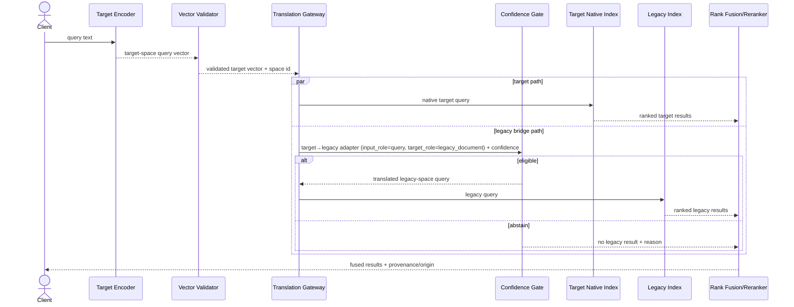
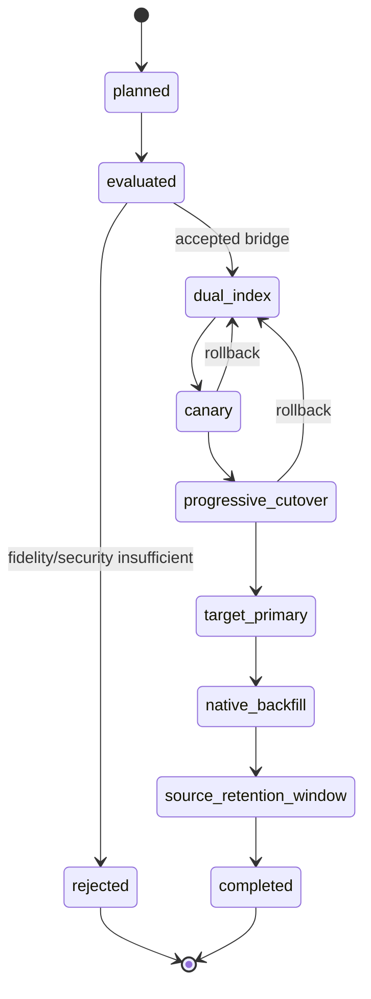
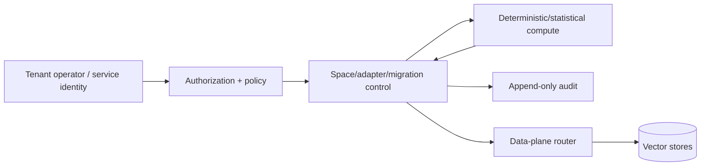
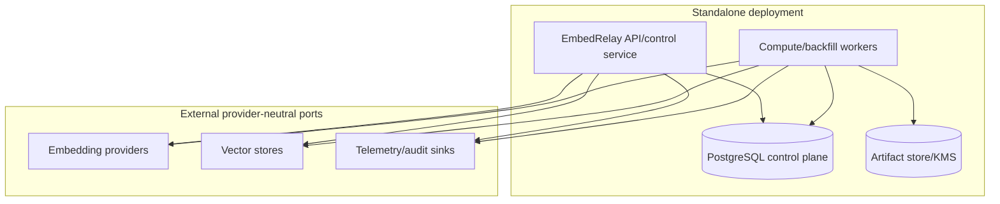

# EmbedRelay UML and Runtime Views

**Status:** Accepted target views; current M1 as-built behavior is marked separately.  
**Last reviewed:** 2026-08-15

## Current M1 registration sequence

```mermaid
sequenceDiagram
    actor Client
    participant Registry as TenantSpaceRegistry
    participant Manifest as Space Manifest
    participant Audit as AuditSink

    Client->>Manifest: canonical manifest
    Manifest-->>Client: embedding-space fingerprint
    Client->>Registry: register(tenant_id, manifest)
    Registry->>Registry: validate UUIDv7 + canonical fingerprint
    Registry->>Registry: reject duplicate tenant/space before audit intent
    Registry->>Audit: space_registration_intent
    alt audit accepted
        Audit-->>Registry: accepted
        Registry->>Registry: make registration observable
        Registry-->>Client: registration
    else audit rejected
        Audit-->>Registry: rejected
        Registry-->>Client: error; state unchanged
    end
```

## Target adapter training sequence



## Target query routing sequence



## Migration state machine



## Authority flow



Vector contents, UUID timestamps, model names, and fingerprints never create authority. Authorization and tenant membership are explicit policy inputs.

## Target deployment view



Current PR #1 has no deployable API, PostgreSQL control plane, vector-store connector, provider connector, or compute worker; this deployment view is target architecture.

## Maturity rule

Diagrams labelled target must not be used as evidence that the named service/database/adapter exists. When a target component becomes as-built, update these views, PRD/TRD, ERD, ADR status, tests, operability, and traceability in the implementing change.
