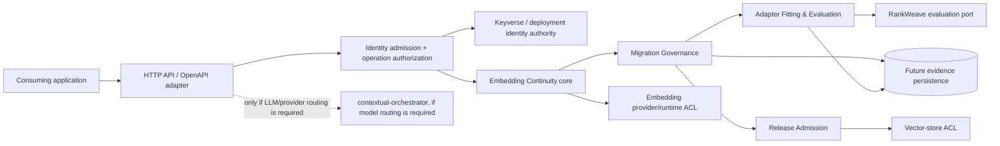
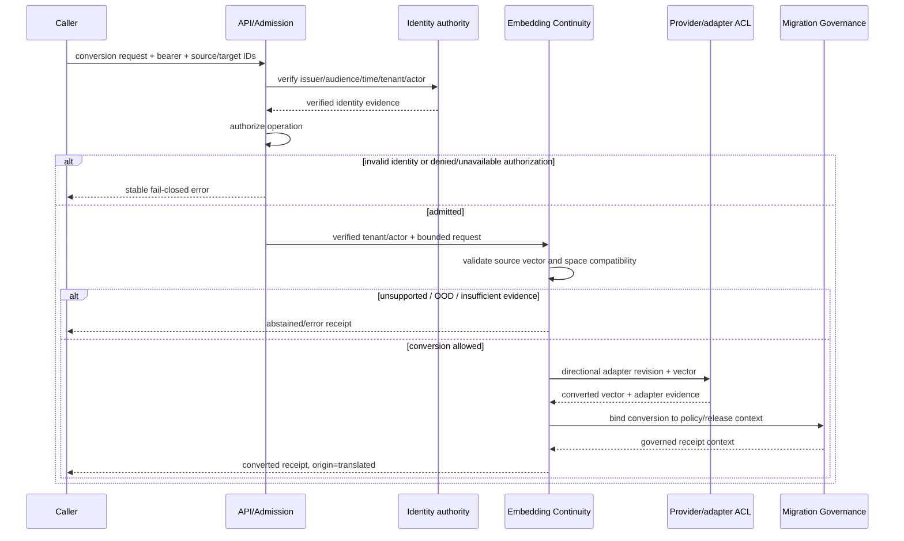
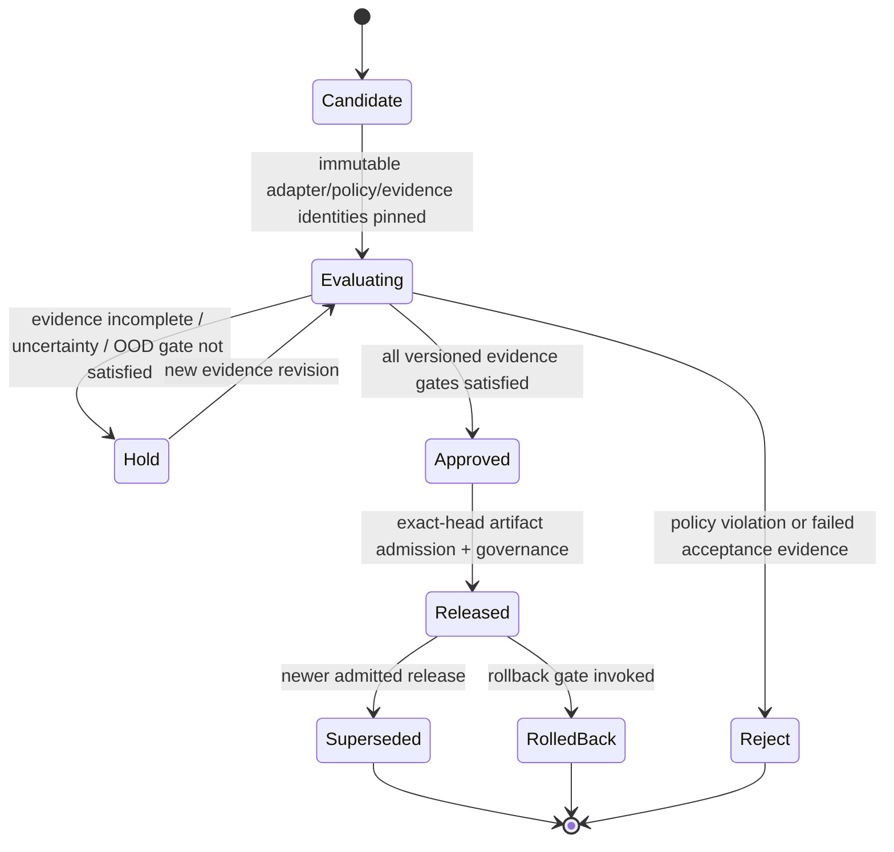
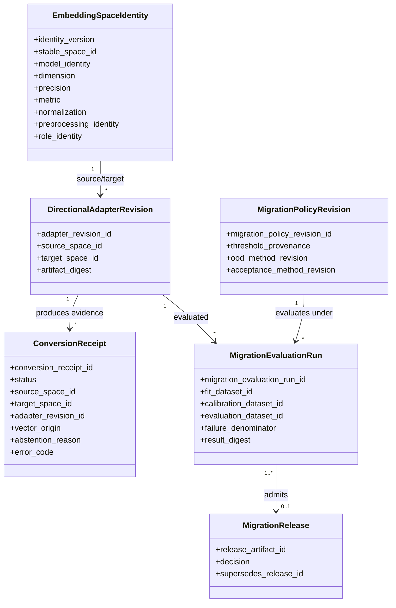

# EmbedRelay UML baseline

Status: pre-release target model; not as-built runtime evidence
Last reconciled: 2026-09-02

## Bounded-context component view

The arrows show target dependency direction, not current deployed services. The domain does not depend on provider SDKs, vector-store implementations, Keyverse internals, RankWeave internals, or contextual-orchestrator persistence.

## Conversion sequence

## Migration-release state model

No transition is authorized by narrative text alone. Thresholds and decision inputs belong to immutable versioned policy/evaluation evidence.

## Domain type sketch

These types are target ubiquitous-language constructs. Their presence in this document does not claim that corresponding Rust structs or database rows exist on the current branch.
