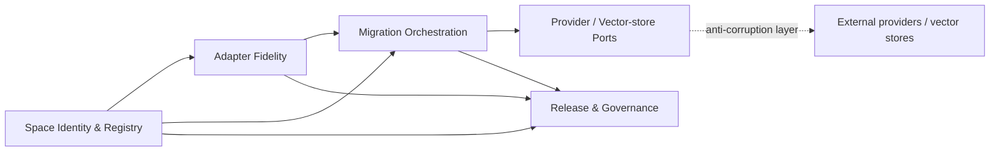
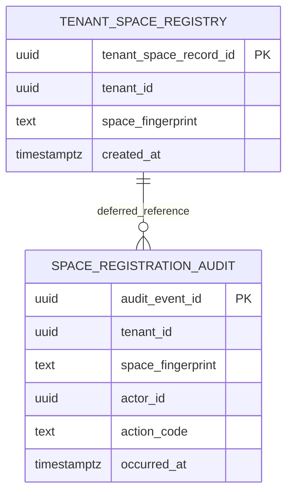

# EmbedRelay Product / Technical Gap Baseline

**Status:** active-PR commercialization baseline  
**Scope:** ContextualWisdomLab/EmbedRelay only, with causal shared-control-plane blockers linked explicitly  
**Last reconciled:** 2026-09-02  
**Release state:** pre-release; PR #1 remains Draft.

Transient CI/review states are resolved live from GitHub rather than committed as durable truth. Every head change invalidates predecessor-head merge evidence.

## Commercial product responsibility

EmbedRelay owns embedding-continuity contracts: immutable embedding-space identity, vector compatibility, durable tenant registry, directional adapter fidelity, controlled migration, abstention, and convergence to target-native embeddings. It does not own embedding-provider execution, vector-store internals, identity federation, or another ContextualWisdomLab product's private persistence. Those dependencies cross typed provider-neutral ports or an anti-corruption layer.

The bounded commercial promise is that operators can change embedding spaces without silently comparing incompatible vectors and without losing tenant isolation, auditability, rollback/recovery evidence, or retrieval-fidelity governance.

## Current feature specification and exact evidence

| Capability | Product owner / bounded context | Current evidence | Active-PR status | Next verification / action |
|---|---|---|---|---|
| Canonical embedding-space identity | Space Identity | `manifest.rs`, manifest tests, PRD-FR-001, ADR-0002 | implemented in Rust on PR #1 | exact-head Rust CI and independent review |
| Fail-closed vector compatibility | Vector Safety | `vector.rs`, vector tests, PRD-FR-002 | implemented in Rust on PR #1 | exact-head coverage/security evidence |
| Opaque UUIDv7 identifiers | Registry Identity | `identifier.rs`, RFC test vector | implemented in Rust on PR #1 | exact-head Rust CI |
| Tenant registration + audit-before-mutation domain contract | Space Registry | `registry.rs`, tenant registry tests | implemented in-memory on PR #1 | keep durable/in-memory invariants reconciled |
| Durable PostgreSQL tenant registry | Space Registry | `migrations/0001_tenant_space_registry.up.sql` / `.down.sql` | implemented on active PR; not protected-main | PostgreSQL 18.6 contract must pass on exact head |
| Forced tenant RLS | Space Registry | forced RLS on `tenant_space_registry` and `space_registration_audit`; negative cross-tenant contract | implemented on active PR; unverified until current CI completes | prove exact-head cross-tenant denial under non-bypass role |
| Immutable durable registry + audit | Space Registry | append-only mutation/truncate triggers; guarded destructive rollback | implemented on active PR; unverified until current CI completes | exact-head PostgreSQL + recovery contracts |
| Concurrent duplicate registration | Space Registry | unique `(tenant_id, space_fingerprint)` key; two-session race contract | deterministic duplicate rejection, not UPSERT | prove exactly one durable registry row and one audit event |
| Logical backup/restore recovery | Operability | `tests/postgres_backup_restore_contract.sh`; CI recovery step | implemented acceptance candidate on active PR | exact-head run must prove two-tenant identity/count reconciliation, RLS, append-only triggers, ACL/comments, backup size and dump/restore timing |
| Adapter registry/fitting | Adapter Fidelity | PRD/TRD/ADRs only | planned | implement Rust fitting/evaluation behind explicit M2 boundary |
| Retrieval-level fidelity and calibration | Adapter Fidelity | PRD-FR-004, Test Strategy, ADR-0010 | planned | canonical evaluation protocol + held-out retrieval evidence |
| Confidence/abstention | Translation Policy | PRD-FR-010, ADR-0007 | planned | executable policy contract and OOD/calibration tests |
| Dual-index migration + rollback | Migration Orchestration | ADR-0005, Operability | planned | executable migration state machine and realistic rollback test |
| Target-native backfill | Migration Orchestration | PRD-FR-007 | planned | provider/vector-store ports and provenance-aware backfill |
| Provider/vector-store interoperability | Integration Ports | ADR-0008 | planned | first real typed adapter; no private-database coupling |
| Release/SBOM/provenance | Release Governance | ADR-0010 plus organization required workflows | partial | exact protected-head receipts and first public release |

## DDD model

### Subdomains

- **Core — Embedding Continuity:** space compatibility, directional translation evidence, abstention, migration correctness, and native-backfill convergence.
- **Supporting — Registry Governance:** tenant-scoped immutable registry, durable audit, recovery/release evidence, drift quarantine, and operator policy.
- **Supporting — Migration Operations:** dual-index state, rollback windows, backfill scheduling, and cutover evidence.
- **Generic — Provider / Vector-store / Telemetry / KMS ports:** versioned integrations that remain outside the domain model and are isolated behind anti-corruption layers.

### Bounded contexts and context map

The shared kernel is intentionally small: canonical space fingerprint, opaque identifiers, and versioned public value contracts. Provider SDK types, persistence implementation details, and another ContextualWisdomLab repository's private data model are not shared-kernel material.

### Ubiquitous language

- **Embedding space:** complete immutable geometry/encoding contract, not a model marketing name.
- **Space fingerprint:** canonical compatibility identity.
- **Native vector:** vector emitted directly by the registered target space.
- **Translated vector:** approximation produced by an explicitly directional adapter.
- **Adapter:** directional, role-specific transformation artifact with evidence and provenance.
- **Abstention:** explicit refusal to translate when evidence or policy is insufficient.
- **Migration plan:** governed progression from source availability through dual operation to target-native terminal state.
- **Space registration intent:** audit evidence recorded in the same transaction before a new registry row becomes committed/observable.

### Aggregates, entities, value objects, services, events, invariants

- **SpaceRegistry aggregate:** tenant + space fingerprint registration boundary. Durable transaction boundary is one registration attempt only; it does not absorb adapter or migration state.
- **EmbeddingSpaceManifest value object:** canonical immutable fields whose fingerprint determines compatibility.
- **RelayIdentifier value object:** opaque RFC 9562 UUIDv7; never authorization or business chronology.
- **ValidatedVector value object:** Rust-validated vector bound to one complete embedding-space identity.
- **Future AdapterArtifact aggregate:** directional artifact + evaluation/calibration evidence; separate transaction/repository from SpaceRegistry.
- **Future MigrationPlan aggregate:** cutover/backfill state and rollback evidence; separate transaction/repository.
- **Domain event / audit intent:** `space_registration_intent`.
- **Invariants:** no raw cross-space comparison; equal dimension is insufficient; tenant authority is explicit; durable registry/audit rows are immutable; audit intent and registration commit atomically; duplicate same-tenant registration is rejected deterministically; same fingerprint may exist independently for different tenants.

## Persistence contract

The current physical M1 slice is relational and intentionally narrow:

Persistence names are descriptive multi-word `snake_case`. The two current relations are in 3NF: facts about a tenant-space registration live in `tenant_space_registry`; audit-event facts live in `space_registration_audit`; the deferred `(tenant_id, space_fingerprint)` foreign key preserves audit-first ordering without duplicating a mutable registry surrogate into the intent contract.

Registration is intentionally **not** an UPSERT. The item-level contract is insert-only: a duplicate `(tenant_id, space_fingerprint)` raises the unique-key outcome and the transaction rolls back its preceding audit insert. If a future API needs idempotent replay, it must add a stable request/idempotency key and a separate test-first contract instead of heuristic conflict handling.

Concurrency is localized to the unique tenant/fingerprint key; there is no global application lock. Partitioning, CQRS/read replicas, or read/write splitting require measured contention/read pressure while preserving forced RLS and the same invariant.

## Security, privacy, operability, and compliance direction

- Forced RLS plus a non-`BYPASSRLS` adversarial contract is the current tenant-isolation mechanism for the M1 persistence slice.
- Public/default privileges are revoked by migration; service access must be granted deliberately.
- Registry and audit records are append-only; destructive rollback is gated by explicit `embedrelay.allow_destructive_rollback=on` and is not an ordinary product operation.
- The logical backup/restore acceptance candidate uses only opaque UUIDs/generated fingerprints, restores into a fresh disposable database, reconciles two tenant registry/audit pairs exactly, and re-proves forced RLS, append-only triggers, application-role privileges and comments. Its backup size and timing are fixture measurements, not production RTO/RPO.
- PITR/WAL archiving, cross-host/object-store transport, encryption/key rotation, HA/failover and production-scale recovery remain unimplemented unless required by the deployment architecture.
- Embeddings, anchors, adapter artifacts, and query/migration evidence remain potentially sensitive; controls must use purpose-bound authorization, encryption/KMS, retention/export governance, and incident evidence rather than destructive masking when masking would break the workload.
- The product is designing toward CSAP/SOC 2 evidence quality, but no certification claim is made.

## Ecosystem boundary

EmbedRelay remains standalone. Optional ContextualWisdomLab consumers/providers such as `contextual-orchestrator`, Keyverse, pg-llm-batch, EgressWeave, and naruon integrate through typed public ports. Reusable supplier defects belong in their source repository. No EmbedRelay persistence object is a shared database contract for another repository.

## Commercialization gaps ordered by leverage

| Priority | Gap | Owner | Evidence | Action | Exact-head status / next verification |
|---|---|---|---|---|---|
| P0 | Durable registry + recovery exact-head verification | Space Registry / Operability | migrations + PostgreSQL registry contract + backup/restore contract + CI service | run PostgreSQL 18.6 RLS/concurrency/rollback/restore acceptance | current successor head requires fresh CI; queued/pending is non-passing |
| P0 | Documentation truth reconciliation | Product Architecture | canonical docs now describe the narrow PostgreSQL slice and recovery candidate | keep implemented vs planned boundaries synchronized | fresh review on current successor head |
| P0 | Central dependency-review gate availability | ContextualWisdomLab/.github | exact-head Security availability remains a shared control-plane concern tracked by `.github#810` | repair the central owner; do not bypass or substitute scanner | consumer must revalidate after upstream fix |
| P0 | Independent approval | Release Governance | organization rules require one qualifying non-author approval | obtain independent review after exact-head checks | cannot self-approve or admin-bypass |
| P1 | Full immutable space manifest persistence | Space Registry | durable M1 stores tenant + canonical fingerprint only | persist the canonical manifest/version contract without duplicating mutable facts | design/test before implementation |
| P1 | Replay-safe API idempotency, if buyer workflow needs it | Space Registry/API | current registration deliberately duplicate-rejects | define stable request key/replay/mismatch/expiry/audit semantics test-first | do not convert current insert contract heuristically |
| P1 | Adapter fidelity/evaluation protocol | Adapter Fidelity | PRD/TRD only | add research-grounded protocol, then Rust fitting/evaluation slice | planned |
| P1 | Buyer-operable migration workflow | Migration Orchestration | no executable service or UI | implement state machine/ports and realistic rollback path | planned |
| P2 | Production recovery architecture | Operability | logical disposable restore candidate only | decide/test PITR/object-store/encryption/failover from deployment needs | not claimed today |
| P2 | Release and downstream integration | Release Governance | no release, no public service package | produce reproducible release receipts and first typed consumer | blocked on earlier evidence |

## Verification rule

Only evidence generated from the current PR head may promote an active-PR row. A predecessor head, queued workflow, PR comment, local reasoning, or mergeability flag is not a passing gate. The next exact-head verification must prove locked Rust dependency resolution, PostgreSQL 18.6 migration/RLS/concurrency/rollback/backup-restore behavior, exact LLVM coverage, central security status, review-thread state, and repository rules without governance weakening.
