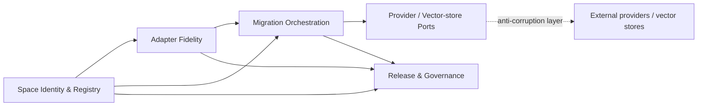
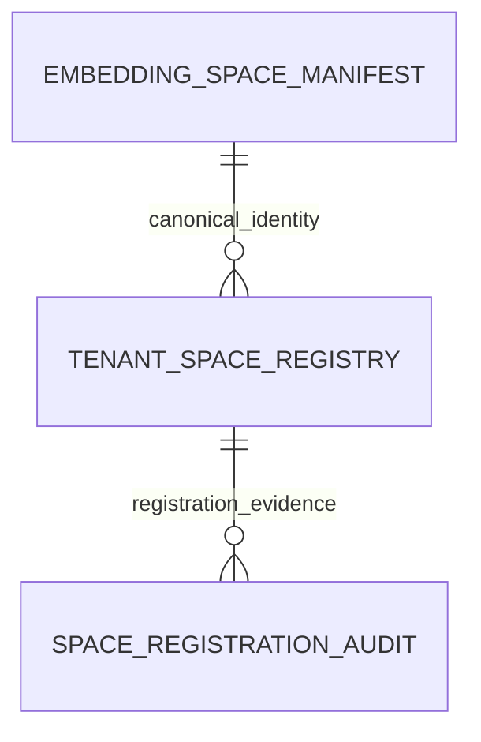

# EmbedRelay Product / Technical Gap Baseline

**Status:** active-PR commercialization baseline  
**Scope:** ContextualWisdomLab/EmbedRelay, with causal shared-control-plane blockers linked explicitly  
**Last reconciled:** 2026-09-02  
**Release state:** pre-release; PR #1 remains Draft.

Transient CI/review states are resolved live from GitHub rather than committed as durable truth. Every head change invalidates predecessor-head merge evidence.

## Commercial product responsibility

EmbedRelay owns embedding-continuity contracts: immutable embedding-space identity, vector compatibility, tenant-scoped registration, directional adapter fidelity, controlled migration, abstention, recovery evidence, and convergence to target-native embeddings. It does not own embedding-provider execution, vector-store internals, identity federation, or another ContextualWisdomLab product's private persistence. Those dependencies cross typed provider-neutral ports or anti-corruption layers.

The bounded commercial promise is that operators can change embedding spaces without silently comparing incompatible vectors and without losing tenant isolation, auditability, rollback/recovery evidence, or retrieval-fidelity governance.

## Current feature specification and exact evidence

| Capability | Product owner / bounded context | Current evidence | Active-PR status | Next verification / action |
|---|---|---|---|---|
| Canonical embedding-space identity | Space Identity | `manifest.rs`, manifest tests, PRD-FR-001, ADR-0002 | implemented in Rust; frozen `sha256:<64 lowercase hex>` identity | exact-head Rust CI and independent review |
| Full immutable canonical manifest persistence | Space Registry | `migrations/0002_embedding_space_manifest.*.sql`; `tests/postgres_manifest_persistence_contract.sh` | implemented on PR #1; full v1 material stored once per fingerprint and fingerprint recomputed in PostgreSQL | exact-head PostgreSQL 18.6 contract/security/review evidence |
| Tenant registration + durable audit | Space Registry | migration 0001, Rust registry contract, PostgreSQL registry contract | implemented; registration duplicate-rejecting, audit-first, append-only | exact-head concurrency/RLS verification |
| Fail-closed vector compatibility | Vector Safety | `vector.rs`, vector tests, PRD-FR-002 | implemented in Rust | exact-head coverage/security evidence |
| Opaque UUIDv7 identifiers | Registry Identity | `identifier.rs`, RFC test vector | implemented in Rust | exact-head Rust CI |
| Forced tenant isolation | Space Registry | RLS on registry/audit plus manifest visibility derived from registration | implemented on active PR | prove same-tenant visibility and outsider denial under non-bypass role |
| Canonical identity recovery | Operability | `tests/postgres_backup_restore_contract.sh` | logical restore now reconciles 2 registry + 2 audit + 2 canonical manifest rows and controls | exact-head CI; do not infer production RTO/RPO/PITR |
| Adapter registry/fitting | Adapter Fidelity | PRD/TRD/ADRs | planned | research-grounded Rust fitting/evaluation boundary |
| Retrieval-level fidelity/calibration | Adapter Fidelity | PRD-FR-004, Test Strategy, ADR-0010 | planned | held-out retrieval protocol and evidence |
| Confidence/abstention | Translation Policy | PRD-FR-010, ADR-0007 | planned | executable policy and OOD/calibration tests |
| Buyer-operable migration workflow | Migration Orchestration | ADR-0005, Operability | planned | executable state machine/ports + realistic rollback |
| Provider/vector-store interoperability | Integration Ports | ADR-0008 | planned | first typed real adapter; no private-database coupling |
| Release/SBOM/provenance | Release Governance | ADR-0010 + organization workflows | partial | protected-head receipts and first public release |

## DDD model

### Subdomains

- **Core — Embedding Continuity:** space compatibility, directional translation evidence, abstention, migration correctness, and native-backfill convergence.
- **Supporting — Registry Governance:** immutable canonical manifests, tenant-scoped registration, durable audit, recovery/release evidence, and drift quarantine.
- **Supporting — Migration Operations:** dual-index state, rollback windows, backfill scheduling, and cutover evidence.
- **Generic — Provider / Vector-store / Telemetry / KMS ports:** versioned integrations isolated behind anti-corruption layers.

### Context map

The shared kernel is intentionally small: canonical space fingerprint, opaque identifiers, and versioned public value contracts. Provider SDK types, persistence implementation details, and another ContextualWisdomLab repository's private data model are not shared-kernel material.

### Ubiquitous language and aggregates

- **Embedding space:** complete immutable geometry/encoding contract, not a model marketing name.
- **Space fingerprint:** exact compatibility identity `sha256:<64 lowercase hex>`; persistence never strips/reconstructs the prefix.
- **SpaceRegistry aggregate:** one manifest-bearing tenant registration transaction. It does not absorb adapter or migration state.
- **EmbeddingSpaceManifest value object / canonical persistence fact:** the 12 v1 material fields plus version whose deterministic fingerprint determines compatibility.
- **RelayIdentifier value object:** opaque RFC 9562 UUIDv7; never authorization or business chronology.
- **ValidatedVector value object:** Rust-validated vector bound to one complete embedding-space identity.
- **Future AdapterArtifact aggregate:** directional artifact + evaluation/calibration evidence.
- **Future MigrationPlan aggregate:** cutover/backfill state + rollback evidence.
- **Domain event / audit intent:** `space_registration_intent`.

Core invariants: no raw cross-space comparison; equal dimension is insufficient; manifest↔fingerprint binding is deterministic; tenant authority is explicit; persisted registry/manifest/audit rows are immutable; audit + registration + canonical material commit atomically; duplicate same-tenant registration is rejected; identical canonical manifests may be shared across tenants without sharing tenant ownership.

## Persistence contract

`embedding_space_manifest` stores immutable v1 compatibility material once per exact fingerprint. `tenant_space_registry` stores tenant association facts. `space_registration_audit` stores append-only intent evidence. This is 3NF: canonical material is not duplicated per tenant or audit event.

`register_tenant_space_manifest(uuid, text, jsonb)` validates the exact v1 key set and primitive/value contracts, computes the Rust-compatible domain-separated SHA-256 using UTF-8 byte-length framing, and rejects a caller-supplied fingerprint that does not match. It then performs audit + tenant registration + canonical manifest insert-or-match in one transaction with deferred references.

Tenant registration is intentionally **not** an UPSERT. Its item-level contract is insert-only duplicate rejection. Canonical manifest persistence intentionally uses insert-or-match because the same immutable fingerprint may be referenced by multiple tenants; a conflict is accepted only after every canonical field matches. Replay-safe API idempotency remains a separate future contract requiring a stable request key.

Forced RLS applies to all three current relations. Manifest visibility is derived through an authorized row in `tenant_space_registry`, preventing an unregistered tenant from enumerating global canonical identity material. No global application lock, partitioning, CQRS/read replicas, or read/write split is introduced without measured pressure.

## Security, privacy, operability, and compliance direction

- Public/default database privileges are revoked and service grants are explicit.
- Registry, manifest, and audit rows are append-only; destructive migration rollback requires explicit `embedrelay.allow_destructive_rollback=on`.
- Logical recovery revalidates canonical material, durable UUIDs, counts, forced RLS, append-only triggers, ACLs/comments, registered tenant views, and outsider denial.
- PITR/WAL archiving, cross-host/object-store transport, encryption/key rotation, HA/failover, and production-scale RTO/RPO remain deployment-dependent and unclaimed.
- Embeddings, anchors, adapter artifacts, and query/migration evidence remain potentially sensitive; controls require purpose-bound authorization, encryption/KMS, retention/export governance, and incident evidence rather than destructive masking when masking would break the workload.
- The product is designing toward CSAP/SOC 2 evidence quality; no certification is claimed.

## Ecosystem boundary

EmbedRelay remains standalone. Optional ContextualWisdomLab consumers/providers such as `contextual-orchestrator`, Keyverse, pg-llm-batch, EgressWeave, and naruon integrate through typed public ports. Reusable supplier defects belong in their source repository. No EmbedRelay persistence object is a shared database contract for another repository.

## Commercialization gaps ordered by leverage

| Priority | Gap | Owner | Evidence | Action | Exact-head status / next verification |
|---|---|---|---|---|---|
| P0 | Canonical manifest persistence verification | Space Registry | migration 0002 + manifest contract + frozen Rust fingerprint | prove exact schema/material/fingerprint/RLS/immutability/migration lifecycle on PostgreSQL 18.6 | implementation present on current writer branch; fresh exact-head CI required |
| P0 | Durable registry + recovery verification | Space Registry / Operability | migrations 0001/0002 + registry/manifest/restore contracts | run RLS/concurrency/rollback/restore acceptance together | successor head requires fresh CI; queued/pending is non-passing |
| P0 | Documentation truth reconciliation | Product Architecture | PRD/TRD/Architecture/ERD/Traceability/baseline | keep active vs planned boundary synchronized | active branch updated; fresh review required |
| P0 | Central dependency-review availability | ContextualWisdomLab/.github | shared control-plane concern tracked upstream | repair causal owner if exact-head gate fails there; never bypass | consumer revalidates after upstream fix |
| P0 | Independent approval | Release Governance | organization policy requires qualifying non-author approval | obtain independent review after exact-head checks | cannot self-approve/admin-bypass |
| P1 | Replay-safe API idempotency, if buyer workflow needs it | Space Registry/API | tenant registration deliberately duplicate-rejects | define request-key/replay/mismatch/expiry/audit semantics test-first | next registry product gap |
| P1 | Adapter fidelity/evaluation protocol | Adapter Fidelity | PRD/TRD only | add current research-grounded protocol then Rust implementation | planned |
| P1 | Buyer-operable migration workflow | Migration Orchestration | no executable service/UI | implement state machine/ports and realistic rollback path | planned |
| P2 | Production recovery architecture | Operability | disposable logical restore only | decide/test PITR/object-store/encryption/failover from deployment needs | not claimed today |
| P2 | Release and downstream integration | Release Governance | no release/public service package | reproducible release receipts + first typed consumer | blocked on earlier evidence |

## Verification rule

Only evidence generated from the current exact PR head may promote an active-PR row. A predecessor head, queued workflow, PR comment, local reasoning, or mergeability flag is not a passing gate. The next exact-head verification must prove locked Rust dependency resolution, PostgreSQL 18.6 registry/manifest/RLS/concurrency/rollback/backup-restore behavior, exact LLVM coverage, central security status, review-thread state, and repository rules without governance weakening.
